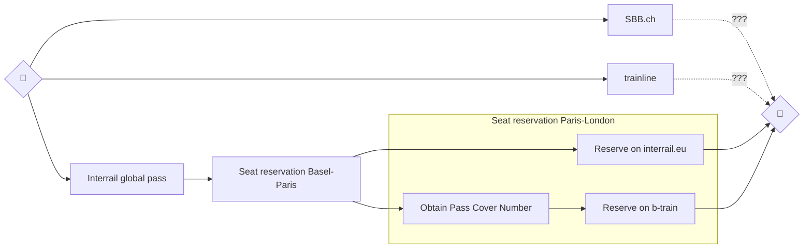

# basel-london-by-train

```mermaid
flowchart LR
    start{"🥺"}
    sbb[SBB.ch]
    trainline[trainline]
    interrail_pass[Interrail global pass]
    seat1["Seat reservation Basel-Paris"]
    target{"🚄"}
    
    subgraph Seat reservation Paris-London
      seat2_interrail["Reserve on interrail.eu"]
      pass_cover_number["Obtain Pass Cover Number"]
      seat2_beurope["Reserve on b-train"]
    end
    
    start --> sbb
    sbb -. ??? .-> target   
    start --> trainline
    trainline -. ??? .-> target
    start --> interrail_pass
    interrail_pass --> seat1
    seat1 --> seat2_interrail
    seat1 --> pass_cover_number
    pass_cover_number --> seat2_beurope
    seat2_interrail --> target
    seat2_beurope --> target
```
