# From Basel to London by Train

You are planning a trip to London and want to take the train? Congratulations, that sounds fun! The aim of this page is to help you book your train ticket. If you are lucky, everything is going to go very smoothly and only take 5-10 minutes. But just to be on the safe side, get a cup of coffee/tea/hot chocolate and make sure that you are in a good state of mind before you proceed.

First an overview of the different options:

```mermaid
flowchart LR
    start{"🥺"}
    sbb[SBB.ch]
    trainline[trainline]
    interrail_pass[Interrail global pass]
    seat1["Seat reservation Basel-Paris"]
    target{"🚄"}
    
    subgraph Seat reservation Paris-London
      seat2_interrail["Reserve on interrail.eu"]
      pass_cover_number["Obtain Pass Cover Number"]
      seat2_beurope["Reserve on b-train"]
    end
    
    start --> sbb
    sbb -. "🍰/☠️ ??" .-> target   
    start --> trainline
    trainline -. "🍰/☠️ ??" .-> target
    start --> interrail_pass
    interrail_pass --> seat1
    seat1 --> seat2_interrail
    seat1 --> pass_cover_number
    pass_cover_number --> seat2_beurope
    seat2_interrail --> target
    seat2_beurope --> target
```

## Price comparison

On 9 November 2022, the prices for a two-ways ticket for a trip from 11 December to 15 December 2022 were:

| **Option** | **Price** |
|------------|-----------|
| SBB.ch     | CHF 457   |
| Trainline  | CHF 417   |
| Interrail  | CHF 384   |

## Options

Here are three (of probably countless) ways to obtain a train ticket. The author of this text only has experience with the Interrail ticket. The other two options seem straightforward but it is nonetheless recommended to be on high alert when trying them.

### SBB.ch

Visit https://sbb.ch/.

### Trainline

Visit https://www.thetrainline.com/.

### Interrail

Interrail does not offer tickets for individual trips but passes that can be used on multiple days in a certain period of time. The smallest global pass can be used on 4 days within a month in 33 countries. There is a discount for people who are not older than 27. A list of global passes can be found on https://www.interrail.eu/en/interrail-passes/global-pass.

After obtaining a global pass, you need to reserve seats on the trains that you want to take. Many trains in Europe don't need a seat reservation but the trains Basel-Paris and Paris-London do require them. The simplest way to reserve seats is using the seat reservation tool of the Interrail website itself: https://www.interrail.eu/en/book-reservations. If you are lucky, you can reserve seats for the whole trip directly from that page.

Unfortunately, for the train from Paris to London (Eurostar), the seats are sold out quickly - especially for holders of the Interrail pass and on interrail.eu.

Frustratingly, it is not possible to check the seat availability before buying the Interrail pass.

If interrail.eu does not work out, you can try to obtain seat reservations from other sources. One of these sources is b-europe.com (https://www.b-europe.com/EN/Booking/Pass). To buy a ticket there, you need to enter your "Pass Cover Number" of your Interrail pass. This number is provided on the paper passes but not directly provided for mobile passes: it's not the same as the "Pass Number". There is a dedicated tool to generate a Pass Cover Number: https://www.interrail.eu/en/book-reservations#/generatePassCoverNumber.

Otherwise, you might be able to obtain a seat reservation by asking people at the train station.

## Contributing

PRs to extend/improve this guide are very welcome!
